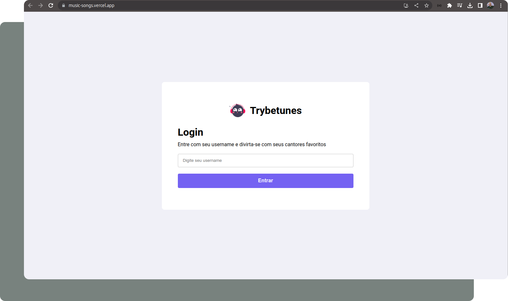
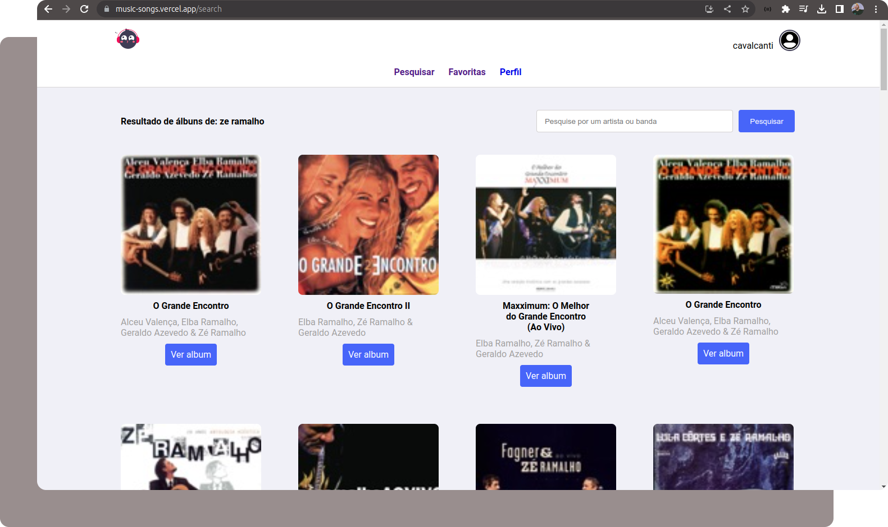
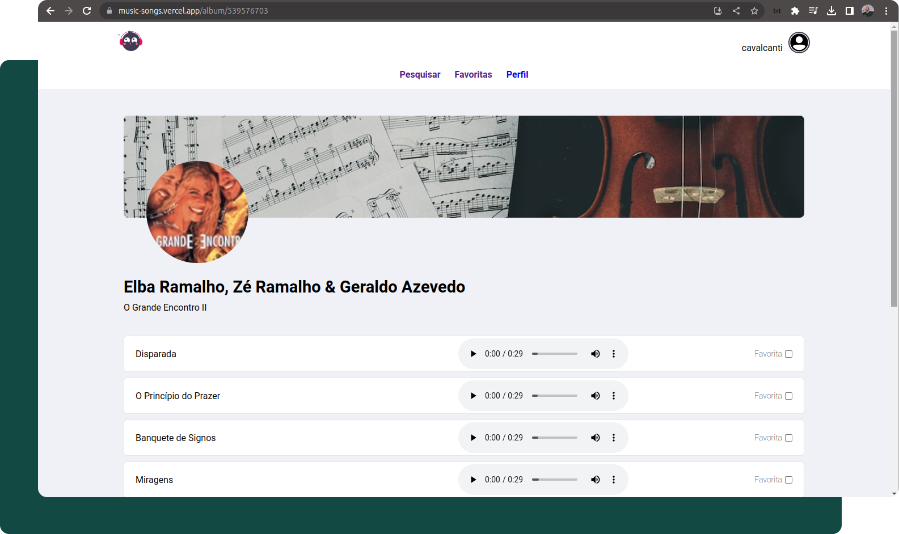

# Musicfy

A Musicfy é uma plataforma interativa e intuitiva que permite aos amantes da música explorar seus álbuns e artistas favoritos de maneira rápida e fácil. Com uma interface moderna e elegante, a aplicação proporciona uma experiência imersiva para os apaixonados por música.

> **Preview:**
> 👉 [Acessar o Musicfy](https://music-songs.vercel.app/)

## Habilidades: 

- **Autenticação Api** via token
- **Javascript** 
- **Redux** para gerenciamento global da aplicação.
- **React Hook** (useState, useEffect).
- **React Hooks Customizados**.
- **React testing library** para garantir a qualidade do código e testar possíveis interações do usuário.
- **Trabalho em equipe**.
- **Scrum Master** para gerenciamento de projetos.
- **Trello** para divisão de tarefas e atualizações do desenvolvimento.

## Apis:

#### Open Trivia Database

A [Trivia API](https://opentdb.com/api_config.php) Database fornece uma API JSON totalmente gratuita para uso em projetos de programação. É preciso gerar um token de autenticação para ter acesso a perguntas triviais.

## Bibliotecas que contém neste projeto:
* **[ReactJS](https://pt-br.reactjs.org/)**
* **[Redux](https://redux.js.org/)**
* **[React Testing Library](https://testing-library.com/docs/react-testing-library/intro/)**

## Layout:

